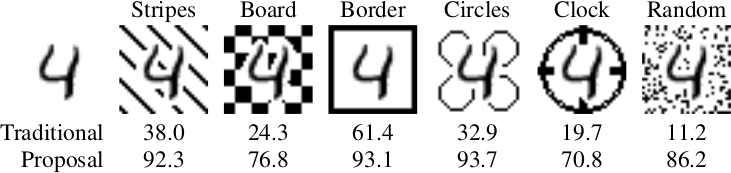
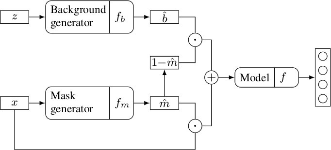

# Background Invariance by Adversarial Learning

Companion code to the publication:

* Background Invariance by Adversarial Learning by Ricardo Cruz, Ricardo M. Prates, Eduardo F. Simas Filho, Joaquim F. Pinto Costa and Jaime S. Cardoso. ICPR 2020. **(to appear)**

***Abstract:*** Convolutional neural networks are shown to be vulnerable to changes in the background. The proposed method is an end-to-end method that augments the training set by introducing new backgrounds during the training process. These backgrounds are created by a generative network that is trained as an adversary to the model. A case study is explored based on overhead power line insulators detection using a drone -- a training set is prepared from photographs taken inside a laboratory and then evaluated using photographs that are harder to collect from outside the laboratory. The proposed method improves performance by over 20% for this case study.

***The idea in a nutshell:***

**Table:** Background changes can produce wild disparate accuracies (%)

**Figure:** Proposed adversarial background augmentation during training.

The model (e.g. classifier, regressor, whatever) tries to minimize a loss and a background generator injects fake backgrounds into the images in order to maximize the loss. In order to inject the backgrounds, we need either manual segmentations or to use a mask generator which is trained in the process. Notice this is not a GAN: there is no discriminator, the backgrounds are not meant to be realistic.

***Code organization:***

In the code, we focused on classification, but the framework could be used for other tasks. The code uses TensorFlow 2.x.

1. `train1.py`, `train2.py`, `train3.py`: these are the training files. For better control over the optimization process and debugging, we decided to divide the optimization process in three phases. *Phase 1:* train only the classifier. *Phase 2:* train the mask generator. *Phase 3:* train both the classifier and background generator adversarially.
2. `mybackgrounds.py`, `mydatagen.py`, `mydatasets.py`: auxiliary files that automatically download the datasets (not all used in the paper) and, in soma cases, create testing versions with new backgrounds.
3. `mymodels.py`: auxiliary file with the architectures.
4. `evaluate.py` and `evaluate_seg.py`: simple evaluation procedures.

***Contact:***

Ricardo Cruz, ricardo.pdm.cruz@gmail.com, rpmcruz.github.io.
